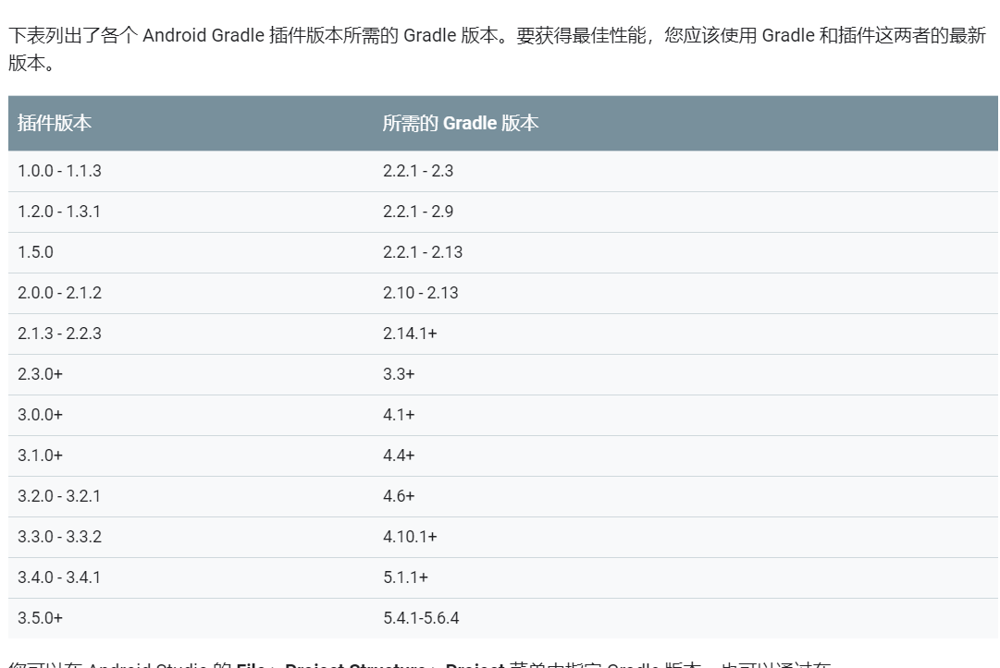

##  Android studio 导入新项目说明  
+ 1.修改为本地可运行的gradle 版本，否则会导致重复下载依赖包（\gradle\wrapper\gradle-wrapper.properties）
+ 2.修改Gradle插件版本 （\build.gradle classpath 'com.android.tools.build:gradle:3.4.2'）
+ 3.修改为本地可运行的build tools 的版本 //导致无法编译(\app\build.gradle  buildToolsVersion = '')  
  

+ 镜像设置  mirrors.neusoft.edu.cn:80

